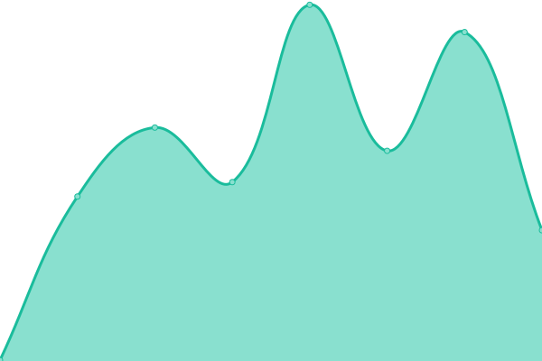

# [📈 Live Status](https://uptime.cloud.clkpts.co.uk): <!--live status--> **🟧 Partial outage**

This repository contains the open-source uptime monitor and status page for [Upptime](https://upptime.js.org), powered by [Upptime](https://github.com/upptime/upptime).

With [Upptime](https://upptime.js.org), you can get your own unlimited and free uptime monitor and status page, powered entirely by a GitHub repository. We use [Issues](https://github.com/upptime/upptime/issues) as incident reports, [Actions](https://github.com/Clickpoints/uptime-monitoring/actions) as uptime monitors, and [Pages](https://uptime.cloud.clkpts.co.uk) for the status page.

<!--start: status pages-->
<!-- This summary is generated by Upptime (https://github.com/upptime/upptime) -->
<!-- Do not edit this manually, your changes will be overwritten -->
<!-- prettier-ignore -->
| URL | Status | History | Response Time | Uptime |
| --- | ------ | ------- | ------------- | ------ |
|  [S01-CPUK-GRA](http://s01.cloud.clkpts.uk) | 🟥 Down | [s01-cpuk-gra.yml](https://github.com/Clickpoints/uptime-monitoring/commits/HEAD/history/s01-cpuk-gra.yml) | 

 0ms
     
 | 

<a href="https://uptime.cloud.clkpts.co.uk/history/s01-cpuk-gra">100.00%</a>
    

|  [S02-CPUK-LON](http://s02.cloud.clkpts.uk) | 🟥 Down | [s02-cpuk-lon.yml](https://github.com/Clickpoints/uptime-monitoring/commits/HEAD/history/s02-cpuk-lon.yml) | 

 0ms
     
 | 

<a href="https://uptime.cloud.clkpts.co.uk/history/s02-cpuk-lon">100.00%</a>
    

|  [S03-CPUK-SBG](http://s03.cloud.clkpts.co.uk) | 🟩 Up | [s03-cpuk-sbg.yml](https://github.com/Clickpoints/uptime-monitoring/commits/HEAD/history/s03-cpuk-sbg.yml) | 

 257ms
     
 | 

<a href="https://uptime.cloud.clkpts.co.uk/history/s03-cpuk-sbg">100.00%</a>
    

|  [S04-CPUK-LON](http://s04.cloud.clkpts.co.uk) | 🟥 Down | [s04-cpuk-lon.yml](https://github.com/Clickpoints/uptime-monitoring/commits/HEAD/history/s04-cpuk-lon.yml) | 

 0ms
     
 | 

<a href="https://uptime.cloud.clkpts.co.uk/history/s04-cpuk-lon">0.00%</a>
    

|  [S05-CPUK-LON](http://s05.cloud.clkpts.co.uk) | 🟩 Up | [s05-cpuk-lon.yml](https://github.com/Clickpoints/uptime-monitoring/commits/HEAD/history/s05-cpuk-lon.yml) | 

 228ms
     
 | 

<a href="https://uptime.cloud.clkpts.co.uk/history/s05-cpuk-lon">100.00%</a>
    

|  [S01-INT](http://s01.office.clkpts.co.uk/) | 🟩 Up | [s01-int.yml](https://github.com/Clickpoints/uptime-monitoring/commits/HEAD/history/s01-int.yml) | 

 685ms
     
 | 

<a href="https://uptime.cloud.clkpts.co.uk/history/s01-int">97.73%</a>
    

|  [S01-TDNL-BGM](https://topdevelop.xyz) | 🟩 Up | [s01-tdnl-bgm.yml](https://github.com/Clickpoints/uptime-monitoring/commits/HEAD/history/s01-tdnl-bgm.yml) | 

 1099ms
     
 | 

<a href="https://uptime.cloud.clkpts.co.uk/history/s01-tdnl-bgm">100.00%</a>
    

|  [S02-AGSW-LON](http://s02.all-green.co.uk) | 🟩 Up | [s02-agsw-lon.yml](https://github.com/Clickpoints/uptime-monitoring/commits/HEAD/history/s02-agsw-lon.yml) | 

 719ms
     
 | 

<a href="https://uptime.cloud.clkpts.co.uk/history/s02-agsw-lon">99.89%</a>
    

|  [S03-AGSW-LON](http://s03.all-green.co.uk) | 🟩 Up | [s03-agsw-lon.yml](https://github.com/Clickpoints/uptime-monitoring/commits/HEAD/history/s03-agsw-lon.yml) | 

 2546ms
     
 | 

<a href="https://uptime.cloud.clkpts.co.uk/history/s03-agsw-lon">100.00%</a>
    

<!--end: status pages-->

[**Visit our status website →**](https://uptime.cloud.clkpts.co.uk)

## 📄 License

- Powered by: [Upptime](https://github.com/upptime/upptime)
- Code: [MIT](./LICENSE) © [Upptime](https://upptime.js.org)
- Data in the `./history` directory: [Open Database License](https://opendatacommons.org/licenses/odbl/1-0/)
